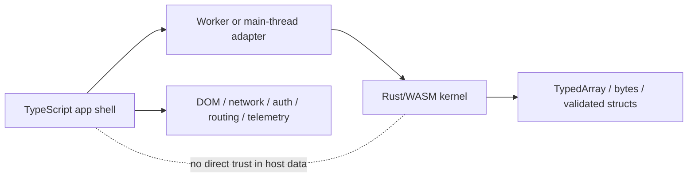

*The shell knows about the world; the kernel knows about the work. Cross the boundary as little as possible, and put the chatty stuff entirely on one side.*

# TypeScript Shell Rust Kernel Architecture

> **Rule:** in a Rust↔WASM↔TS system, TypeScript owns everything that interacts with the world — lifecycle, routing, DOM, auth, network, telemetry. Rust owns pure compute behind a small API. The boundary between them is narrow, intentional, and reviewed.

This is the canonical architecture for a Rust/WASM project that consumes its kernel from a TypeScript host. The split is not arbitrary: it tracks where each language's runtime is actually good. JavaScript is the native runtime of browsers, of Node services, of npm packaging, of the DOM, of `fetch`, of `setTimeout`, of every host integration. Rust compiled to WASM is a sandboxed compute environment with sharp memory boundaries and no native concept of any of those things.

## The architecture



Reading this diagram:

- **TypeScript app shell (A)** — the application. Owns user-facing concerns, request lifecycle, error reporting, configuration, feature flags, and observability.
- **Adapter (B)** — the thin layer that loads the WASM module, manages its lifecycle (compile once, instantiate as needed), validates inputs going in, and converts outputs going out. May live in a worker (see [[Integration/Rust-WASM-TS/Decision and Architecture/Workers Before WASM]]).
- **Rust/WASM kernel (C)** — pure compute. Receives validated inputs, returns computed outputs. No knowledge of HTTP, DOM, time-of-day, user identity.
- **Data flow (D)** — `TypedArray`s, byte buffers, validated structs cross the boundary. Object-heavy crossings are minimized (see [[Integration/Rust-WASM-TS/Boundary Design/Boundary Crossing Cost]]).
- **The dotted line** — Rust does not trust host data implicitly. Inputs are validated at the boundary; the kernel's invariants are its own to enforce.

## What lives in the shell

The TypeScript shell owns:

- **Application lifecycle.** Process startup, graceful shutdown, signal handling, supervisor integration.
- **Routing and request dispatch.** Whether HTTP, RPC, message-bus, or batch.
- **DOM and UI state.** See [[Integration/Rust-WASM-TS/Error Handling and DOM/DOM Ownership Boundary]].
- **Authentication and authorization context.** AuthN/Z runs in TS; the kernel may receive an opaque token or verified-identity object but does not perform auth itself.
- **Network and storage I/O.** `fetch`, database clients, caches, message-bus producers/consumers.
- **Telemetry and observability.** Logs, metrics, traces. The shell is what knows about correlation IDs (see [[Languages/TypeScript/Practices/Async and Concurrency/Async Context Propagation]]).
- **Configuration management and feature flags.** OpenFeature integration, dynamic config, secret loading.
- **Error reporting and recovery.** Catch points, retries, circuit breakers, fallback behavior.
- **Build and release pipeline integration.** The shell is what gets canaried, monitored, rolled back.

## What lives in the kernel

The Rust/WASM kernel owns:

- **Pure deterministic computation.** Algorithms whose output depends only on input.
- **Data transforms.** Buffer in, buffer out. Image processing, codec encode/decode, parser/serializer round trips.
- **Mathematical / numerical kernels.** Linear algebra, FFT, statistical computation.
- **Domain-specific solvers.** Constraint satisfaction, rules evaluation, decision engines that operate on validated data.
- **Cryptographic primitives.** Where Rust's audited crates and timing-safety properties matter.

The kernel does not own:

- Network calls (no `fetch` in WASM core).
- DOM (the shell owns it).
- Time and randomness (these are hostile-data inputs the shell provides).
- User-facing error messages (the shell formats; the kernel returns typed error variants).
- Configuration discovery (the kernel is given config; it does not look it up).

## Why the split is the canonical pattern

Three structural reasons:

1. **Each runtime is best at what it owns.** JavaScript's native I/O integration is excellent and free. WASM's compute density is excellent and free. Putting each on the wrong side of the boundary loses both.
2. **The boundary cost is finite.** Object-heavy crossings, host API plumbing, and JS↔WASM context switching all cost real time. Minimizing crossings is a structural property of the architecture, not a tuning effort.
3. **Failure containment.** A bug in the TS shell doesn't corrupt kernel memory; a panic in the kernel doesn't crash the shell's request handler if the boundary handles it correctly. Each side's invariants are local.

## What the kernel API should look like

The boundary between shell and kernel is a designed artifact, not an emergent one. The discipline:

- **Coarse-grained.** One call does substantial work. A kernel function that does a single byte XOR is wrong; a kernel function that processes a whole frame is right.
- **Buffer-oriented for hot paths.** `&[u8]` in, `&[u8]` (or `Vec<u8>`) out. See [[Integration/Rust-WASM-TS/Boundary Design/Boundary Crossing Cost]].
- **Stable across versions.** Generated TS surfaces (see [[Integration/Rust-WASM-TS/Boundary Design/Generated TypeScript Surfaces]]) are public APIs reviewed on every change.
- **Result-typed.** Errors are `Result<T, E>`; the TS side gets exceptions or `Result` shapes (see [[Integration/Rust-WASM-TS/Error Handling and DOM/Error Propagation Across Boundary]]).
- **Validated inputs.** The kernel does not trust the shell's inputs blindly. Either the shell validates with a runtime schema before calling, or the kernel validates as its first action. Both is fine; neither is a bug.

## A worked example shape

A Rust kernel for image processing:

```rust
#[wasm_bindgen]
pub fn apply_filter(
    input: &[u8],          // raw image bytes (validated by caller)
    width: u32,
    height: u32,
    filter: FilterKind,    // a small enum
) -> Result<Vec<u8>, JsError> {
    // pure computation; no I/O, no DOM, no time
}
```

The TS side:

```ts
import init, { apply_filter, FilterKind } from "./pkg/image_kernel.js";

await init();

async function processUploadedImage(file: File): Promise<Uint8Array> {
  const buf = new Uint8Array(await file.arrayBuffer());
  const { width, height } = await decodeHeader(buf);
  return apply_filter(buf, width, height, FilterKind.Sharpen);
}
```

The shell handles the upload, decodes metadata, calls the kernel once with the buffer, gets bytes back, and continues. The kernel did one big thing; the shell did everything else.

## Composing with other practices

- [[Integration/Rust-WASM-TS/Decision and Architecture/When Rust-WASM Is Justified]] — the prior decision; only adopt this architecture if the kernel earns its place.
- [[Integration/Rust-WASM-TS/Decision and Architecture/Workers Before WASM]] — the kernel may run in a worker for CPU isolation.
- [[Integration/Rust-WASM-TS/Boundary Design/Boundary Crossing Cost]] — what makes the API "small" structurally.
- [[Integration/Rust-WASM-TS/Error Handling and DOM/DOM Ownership Boundary]] — explicit corollary: TS owns DOM.
- [[Engineering Philosophy/Principles/Architectural Core Principles]] — narrow external-system boundaries; the kernel is, in shell terms, an external system.
- [[Languages/Rust/Workspace/Core Principles]] — the same pattern in Cargo workspace topology.

## Related

- [[Integration/Rust-WASM-TS/Decision and Architecture/When Rust-WASM Is Justified]]
- [[Integration/Rust-WASM-TS/Decision and Architecture/Workers Before WASM]]
- [[Integration/Rust-WASM-TS/Boundary Design/Boundary Crossing Cost]]
- [[Integration/Rust-WASM-TS/Error Handling and DOM/DOM Ownership Boundary]]
- [[Engineering Philosophy/Principles/Architectural Core Principles]]
